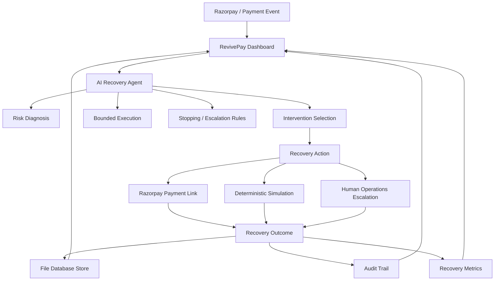

# RevivePay — AI Agent for Revenue Recovery

**Razorpay AI Buildathon 2026**  
**Track 03 — AI Revenue Recovery**

RevivePay is an autonomous AI agent prototype designed to detect, diagnose, and recover lost revenue from failed payments, abandoned checkouts, expired cards, and overdue invoices.

---

## 📌 Architecture Overview



---

## 🎯 Problem & Product Overview

### The Problem
E-commerce businesses and SaaS platforms lose significant revenue due to involuntary payment churn—temporary bank downtime, card expirations, insufficient funds, or abandoned checkouts. Blindly retrying cards can trigger gateway friction, high failure fees, or account blocks.

### The RevivePay Solution
RevivePay replaces rigid, dumb retry schedules with an intelligent, bounded recovery workflow:
1. **Detects** payment failures and calculates real-time risk scores.
2. **Diagnoses** the underlying failure cause using AI and failure telemetry.
3. **Selects** the appropriate recovery intervention (e.g. Smart Payment Links, direct retries, or card update prompts).
4. **Executes** bounded recovery workflows with strict stopping rules (max 3 retries) and human escalation for fraud indicators.
5. **Maintains** a complete, immutable audit trail of every agent decision for merchant compliance.

---

## 🔄 End-to-End Recovery Workflow

```text
At-Risk Payment
       │
       ▼
AI Risk Diagnosis & Scoring
       │
       ▼
Intervention Selection (e.g. SEND_SMART_PAYMENT_LINK)
       │
       ▼
Bounded Recovery Execution (Razorpay Payment Links API)
       │
       ▼
Customer Test Checkout (Razorpay Test Mode)
       │
       ▼
Payment Verification / Webhook (payment_link.paid)
       │
       ▼
Case Status -> RECOVERED
       │
       ▼
Metrics & Audit Trail Update
```

---

## 🛠️ Key Capabilities & Features

- **Fintech Operations Dashboard**: Real-time operational view with key metrics (Revenue at Risk, Revenue Recovered, Recovery Rate %, Active Cases, Escalations, Recovered Count).
- **Interactive Cases Console**: Sortable and filterable case management table displaying risk scores, failure codes, and recommended interventions.
- **AI Decision Rationale**: Detailed modal view for each case breaking down detected issues, diagnosis, intervention rationale, stopping rules, and step-by-step execution history.
- **Razorpay Test Mode Integration**: Native integration with Razorpay Payment Links API (`POST /v1/payment_links`) featuring SMS & email notification flags.
- **Deterministic Simulator Fallback**: 100% offline fallback engine ensuring zero downtime when Razorpay API credentials are not set or when network access is unavailable.
- **Audit Trail Logging**: Step-by-step JSON-backed audit timeline recording every agent input, output, decision rationale, and status transition.

---

## 💻 Technology Stack

- **Framework**: Next.js 15 (App Router, Server Components & Route Handlers)
- **Frontend**: React 18, Tailwind CSS, Lucide React Icons
- **Language**: TypeScript 5 (Strict Mode)
- **Database**: File-backed JSON store (`revivepay-db.json`) ensuring cross-platform zero-dependency execution
- **API Integration**: Official Razorpay REST API (Payment Links & Webhooks)
- **AI & Rules Engine**: Gemini API with deterministic fallback decision tree

---

## 📁 Project Structure

```text
revivepay/
├── app/
│   ├── api/
│   │   ├── batch-recover/       # Batch AI recovery API
│   │   ├── cases/               # Cases list & reset seed API
│   │   │   └── [id]/
│   │   │       ├── recover/     # Single-case AI recovery API
│   │   │       └── verify-link/ # Razorpay Payment Link verification API
│   │   └── webhooks/
│   │       └── razorpay/        # Razorpay HMAC verified webhook handler
│   ├── globals.css              # Dark theme global styles
│   ├── layout.tsx               # Root layout
│   └── page.tsx                 # Operations Dashboard UI
├── components/
│   ├── Header.tsx               # Top navigation & action buttons
│   ├── MetricsOverview.tsx      # Top metric cards summary
│   ├── CasesTable.tsx           # Interactive case management table
│   └── CaseDetailModal.tsx      # AI Decision & audit trail modal
├── lib/
│   ├── agent/
│   │   ├── engine.ts            # AI Agent recovery engine & batch runner
│   │   ├── llm.ts               # AI diagnosis & fallback rules engine
│   │   └── types.ts             # TypeScript definitions
│   ├── db/
│   │   ├── index.ts             # File database CRUD & metrics calculation
│   │   └── seed.ts              # Pre-seeded synthetic failure dataset
│   └── razorpay/
│       └── client.ts            # Razorpay REST client & HMAC signature validator
├── scripts/
│   ├── test_engine.ts           # Phase 1 & 2 recovery engine test suite
│   ├── test_phase3.ts           # Phase 3 Razorpay & webhook test suite
│   └── verify_all.ts            # Complete end-to-end system verification script
├── .env.example                 # Environment configuration template
└── README.md                    # Project documentation
```

---

## 🚀 Quickstart & Local Setup

### 1. Prerequisites
- Node.js 20+ installed
- npm installed

### 2. Installation
```bash
git clone https://github.com/piyush06singhal/revivepay_razorpay_buildathon.git
cd revivepay_razorpay_buildathon
npm install
```

### 3. Environment Configuration
Create a `.env.local` file in the root directory:
```bash
# Set to true for live Razorpay API calls, or false for offline simulator
ENABLE_LIVE_RAZORPAY_API="false"

# Optional Razorpay Test Credentials
RAZORPAY_KEY_ID="rzp_test_..."
RAZORPAY_KEY_SECRET="your_key_secret"
RAZORPAY_WEBHOOK_SECRET="your_webhook_secret"
```

### 4. Running the Application
```bash
npm run dev
```
Open [http://localhost:3000](http://localhost:3000) in your browser.

---

## 🧪 Testing & Verification

Run the comprehensive test suites to verify system functionality:

```bash
# 1. TypeScript Type Checking
npx tsc --noEmit

# 2. Phase 1 & 2 Recovery Engine Test
node --import tsx/esm scripts/test_engine.ts

# 3. Phase 3 Razorpay & Webhook Verification Test
node --import tsx/esm scripts/test_phase3.ts

# 4. Complete End-to-End System Verification
node --import tsx/esm scripts/verify_all.ts

# 5. Next.js Production Build
npm run build
```

---

## 🔒 Security Practices

- **Zero Secret Leakage**: `RAZORPAY_KEY_SECRET` and `RAZORPAY_WEBHOOK_SECRET` are strictly processed server-side inside Next.js Route Handlers.
- **HMAC Signature Verification**: Razorpay webhook payloads are verified using HMAC SHA256 timing-safe comparison.
- **Environment Isolation**: `.env`, `.env.local`, and runtime database files are excluded via `.gitignore`.

---

## 📝 Prototype Limitations & Buildathon Scope

- **Synthetic Data**: Initial metrics and pre-seeded cases are synthetic demonstration data designed for the Razorpay Buildathon.
- **Bounded Automation**: Retries are capped at 3 attempts maximum. High-risk fraud indicators automatically trigger human operations escalation.
